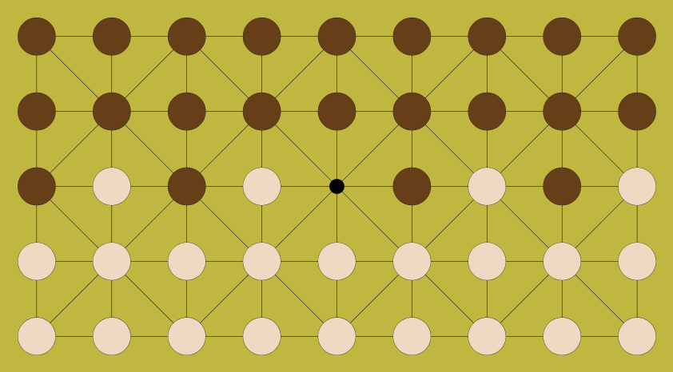

# Fanorona AI

## Overview of the Game

Fanorona is a two-player strategy boardgame from Madagascar.
The version we will (roughly) be playing, Fanorona-Tsivy, is played on a 
$$9\times 5$$ board with the following starting configuration: 

{:.w300px}

Tiles are placed on vertices and may move along any edge from
a given vertex. Note that on this style of board, sometimes known
as an [Alquerque](https://en.wikipedia.org/wiki/Alquerque) board,
diagonals are sometimes (but not always) available. 

The player with light coloured tiles moves first, and moves are split into three
main categories:

1. Capturing moves.

A player may capture a contiguous line of opponent pieces
by **either** approaching **or** withdrawing from such a contiguous line. 

Such a move is classified as either an `Approach` or a `Withdrawal`, and defined
by the `Location`s the piece moves from and to.

At the start of a *turn*, a *player* must make a capturing move if it is possible to do so.
After making such a move, lets call the piece that moved the *Captor*. If it is possible
for the *Captor* to move again, provided it visits no *Location* more than once in a 
*turn*, the *player* may make another move. If, after a *turn* has started,
the *Captor* cannot make a capture, then the *turn* is over and it is the *other player*'s
turn.

2. Pass

A player may terminate a *turn* early by making a 
Pass. Note that a player cannot Pass unless a *turn* has already started (i.e., there is a Captor).

Note that Pass moves will not appear in the list of legal moves. It is up to you
to decide when they should be considered, but they must be considered (and can only
be called when legal to do so).

COMP1100 students use a slightly simplified version of the game where *turn*s of
capturing sequences must be completed, not truncated by passing.

3. Paika.

If, at the start of a *turn* there is no possible *capturing move*, then
you may make a *Paika* move, moving any of your pieces to an adjacent empty vertex.
this also concludes the *turn*.

The game is over if either a board position is repeated (this can only occur after
a sequence of *Paika* moves) --- in this case ending in a draw --- or when one player
is not able to make a move (typically because they have used all their pieces). The
player who made the last move is then the winner, and the player who cannot move the loser.

The game will also end in a draw if there have been more than 20 consecutive Paika moves,
but this should be very rare.

## Overview of Project

**Introduction**

The definition of AI; the theory and development of computer systems able to perform tasks normally requiring human intelligence. In this Haskell motivated program, an AI capable of playing the indigenous Madagascan board game: Fanorona, is to be designed. Through using a file of predefined functions, several well-known game choice algorithms such as greedy, minimax, and alpha-beta pruning were developed into AIs capable of playing Fanorona.

**Documentation**

**Greedy AI**

The greedy AI, as suggested by the name, applies the greedy algorithm to its playstyle. This being the move that provides the greatest immediate advantage for the player. The heuristic implemented for this AI is to prioritise the move that captures the highest number of opponent pieces.

Helper functions were designed to aid the greedy AI in making the greediest move:

- The **pieces** function takes a move as input and returns the number of opponent pieces in the next game state when applied by the move.
- The **listOfPieces** function takes a list of moves as input and generates a list of tuples of (Player 1, Player2) pieces.
- The **opponentPieces** function takes a list of tuples generated by listOfPieces and returns the list of opponent pieces.

The greedy AI takes an input of a GameState. This game state is used on legalMovesPass to generate a list of legal moves that can be made by the AI. The greediest move was found by pattern matching with this list and checking if the opponent’s number of pieces in the next game state is equal to

the smallest number possible.

**Minimax AI**

The minimax AI applies the minimax algorithm, which enables it to look n steps ahead to find the most appropriate move with the assumption that the opponent will play the best they can. To allow the AI to make this decision, a heuristic similar to greedy was implemented; prioritise the move that results in the greatest piece advantage. To implement minimax, a substantial number of helper functions were implemented:

**maxLeaves** - takes a RoseTree as input and returns the maximum heuristic value of the tree’s leaves. This function is used in valueTree and mmTree to replace the root node with the maximum of its leaves if it is Player 1’s turn.

**minLeaves** - takes a RoseTree as input and returns the minimum heuristic value of the tree’s leaves. Similarly, this function is used in valueTree and mmTree to replace the root node with the minimum of its leaves if it is Player 2’s turn.

**pieceDifference** - takes a GameState as input and returns our heuristic value; the difference in Player 1 and Player 2’s pieces, where Player 1 is the maximiser and Player 2, the minimiser. **roseChildren** - Takes a RoseTree as input and returns the root’s children as a list. This list is used in minimax to pattern match over each child; searching for the desired game states in accordance to its heuristic value.

**roseLeaves** - takes a RoseTree as input and returns its leaves as a list.

**legalMovesPass** - appends the Pass move to the list of legalMoves, allowing the AIs to consider Pass as an option.

**gameTree** - generates a rosetree of tuples containing a state and the piece difference in that state. **cutDepth** - cuts a tree to n depth.

**gameStates** - takes a tuple of a game state and piece difference and generates a list of the next possible game states and their respective piece differences.

Since the Minimax algorithm iterates through the game tree to look for the best possible move, a game tree containing the heuristic value and GameState must be recursively generated. This was implemented through cutDepth depth (gameTree gameStates (0, state)). The composition of functions generates a RoseTree of tuples containing the piece difference and the GameState. The gameTree function uses list comprehension and anonymous functions to generate each depth of possible GameStates through the gameStates function. Since this recursive call is infinite, the cutDepth function cuts the tree, generating a tree of a specified depth. This function is then called in valueTree, which generates the game tree with the most optimal path replaced by the greatest heuristic value. However, to avoid the possibility of 2 or more nodes sharing the same heuristic value at the same depth, another function, mmTree, was implemented to update all nodes replaced earlier with the values 50 and -50; the best possible move for the maximiser and minimiser respectively. minimax returns the best possible move through pattern matching against the list of possible game states and its heuristic value. The function recurses through the list until it finds the node containing the best heuristic value (different depending on which player’s turn it is), returning the respective Move which results in

that GameState.

**Reflection**

I decided to write the minimax AI through generating a game tree and making changes to it in two separate functions as it seemed most intuitive to apply changes to a pre-generated tree. This created convenience when finalising the minimax function and resulted in easier debugging solutions. In the primary minimax function, I decided to pattern match the list of next possible game states generated by the list of moves with the optimal heuristic value and its respective game state. This allows me to directly reference the corresponding move which generates the GameState containing the optimal heuristic value.

Although appearing as more efficient code-wise, the minimax function requires a much longer runtime due to the extensive amount of times a game tree was generated and iterated. This led to the minimax function possessing a greater big-O notation than usual, allowing it to only look 6-10 steps ahead into the game tree. To solve this issue, I attempted to prune the tree which the function was iterating over by using recursion on the maximal/minimal node rather than the list of nodes. Even so, the function resulted in a higher run-time as the game tree was still being fully generated before the pruning process. If I were to do the assignment again, I would spend more time considering alpha-beta pruning, as this algorithm possesses a significantly lower time complexity compared to the Minimax algorithm, allowing the alpha-beta pruning AI to iterate over exponentially more steps.

The implementation of a new heuristic was also considered for the minimax AI. Using piece difference as a heuristic is not ideal in Fanorona as when both players enter the end game (15 or less total pieces on board), this heuristic fails as a game-winning strategy. Hence, I considered a change of heuristics once the total number of pieces was below 15. After playing a number of Fanorona games, it became clear that controlling the centre of the board provided a huge advantage for the player. However, I was unsure of how to implement this heuristic alongside the piece advantage heuristic. Furthermore, the program would crash as there won’t always exist a move to control the centre of the board and not lose pieces.

**Testing**

All the helper functions for minimax were tested individually; by calling the function in terminal and also through running cabal v2-test with the written unit tests. The minimax AI was initially tested by verifying if the game tree generated was correctly represented. Since the game tree for minimax was composed of several unique functions, each were tested separately with the command :set +s to understand the approximate time complexity of the functions. This allowed me to identify the exact point in which the function starts running inefficiently.

cutDepth depth (gameTree gameStates (0, state)) took a runtime of 0.18 seconds, showing that the function for generating the game tree is implemented quite optimally. However, valueTree (initialState (4,2)) 4 had a runtime of 4.54 seconds, showing that the O value for valueTree was significantly higher than the composite functions for the game tree.

Although the game trees can be generated, there is an extent to which the tree can be understood. Thus, the assumption that the tree had been implemented correctly was made to continue further tests with the AI. After these individual tests were run and the functions were debugged, the helper functions were finally used in the minimax function and tested in CodeWorld. Any errors or crashes within CodeWorld resulted in another instance of testing being performed; by stepping through the code, making sure that everything made logical sense with respect to the minimax algorithm.

After the minimax AI returned an appropriate output, the AI was played against previously designed AIs such as greedy and firstLegalMove in CodeWorld. The results of these matches represented how well minimax performs, and was clearly shown to outperform both greedy and firstLegalMove.
